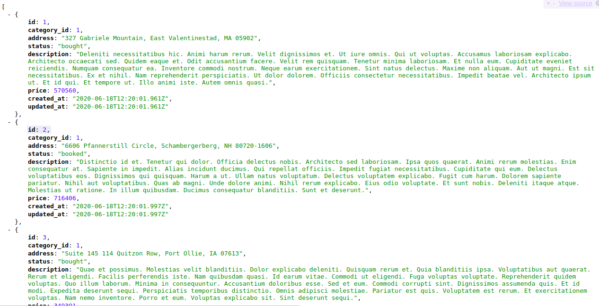

# Real Estate API 

A rails API application that is consumed by [Real-Estate-Client](https://github.com/wathigo/Real-Estate-Client/blob/property/README.md). The application handled user authentication using [JWT](https://jwt.io/). There are endpoints that require authentication/protected endpoints and those that don't.

Let's start by listing the list of unprotected endpoints:
* POST /authenticate. The endpoint used to authenticate/log in a user.
* POST /auth/signup. The endpoint that is used when creating a new user.
* GET /categories. Endpoint used for getting all the categories.
* GET /properties. The endpoint used to fetch all the properties.
* GET /properties/:id. Used to get a specific property record.

All the other endpoint requires the user to be authenticated. They include:
* GET /user. Endpoint used to retrieve the current user.
* PATCH /categories/:id. Used to update specific fields of an already existing category record.
* PUT /categories/:id. Used to update all the fields of an existing category record.
* DELETE /categories/:id. Used to delete an existing category record.
* POST /properties. Used to create a new property record.
* PATCH /properties/:id. Used to update specific fields of an existing property record.
* PUT /properties/:id. Used to update all the fields of an existing property record.
* DELETE /properties/:id. Used to delete an existing property record.
* PUT /add_geo_location. Creates a geo_location record for an existing propery record.
* GET /geo_location. Fetches the geo_location record for an existing property record.
* PUT /add_favourites. Creates a favourite record for the current user.
* GET /my_favourites. Gets all the favourite properties of the current user.

All of the above endpoints have been tested for the negative and positive scenarios.

## Live Link
See the all the properites using the unprotected route [here](https://fun-rails-api.herokuapp.com/properties).

## :package: Built With

    - Rails
    - API
    - Rpec
    - JWT
    - Postgress

## :computer: Getting Started

    To get a local copy up and running follow these simple steps.

## :arrow_heading_down: Install

1) Clone the repository to your local machine
```sh
$ git clone https://github.com/wathigo/Real-Estate-API.git
```

2) cd into the directory
```sh
$ cd Real-Estate-API
```

3) install dependencies 
```sh
bundle install
```

4) Migrate to the database
```sh
rails db:migrate
```

5) Seed in some data
```sh
rails db:seed
``` 

6) Start the development server
```sh
rails start
```

## :arrow_forward: Usage
To use the API visit  https://real-estate-client.netlify.app and make use of the hosted version with seeded data.
Tools like [postman](https://www.postman.com/) can also be used to test each endpoits.
The tests also makes sure that each and every endpoint has been tested.
<p align="center">
<a href="#">
   
 </a>
</p>

## :vertical_traffic_light: Testing
To run the tests:
```sh
bundle exec rspec
```


## :busts_in_silhouette: Authors

👤 **Simon Wathigo**

- Linkedin: [Simon Wathigo](https://www.linkedin.com/in/simon-wathigo/)
- Github: [@wathigo](https://github.com/wathigo)

## 🤝 Contributing

    Contributions, issues and feature requests are welcome!

Feel free to check the [issues page](../../issues).

## :star2: Show your support

    Give a ⭐️ if you like this project!

